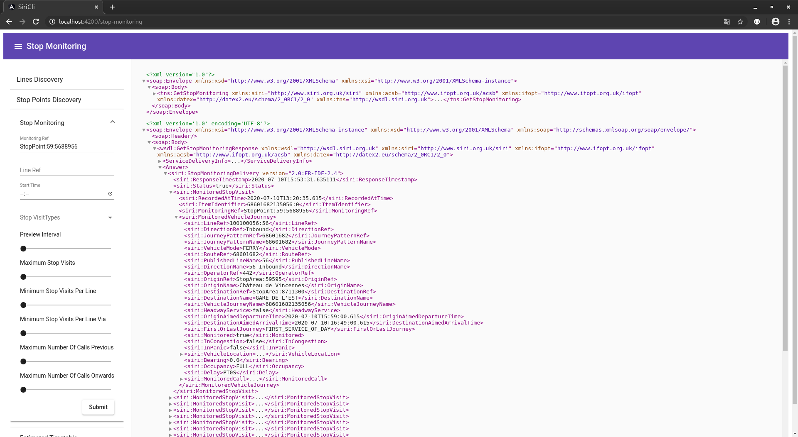

# Siri Demo

# Siri Demo
Demo OpenShift (Redhat Kubernetes) 

http://siri-demo-siri-demo.7e14.starter-us-west-2.openshiftapps.com/siri-cli/index.html

### Siri Lite Cli (version Angular)
http://siri-demo-siri-demo.7e14.starter-us-west-2.openshiftapps.com/siri-lite-cli/index.html

### Siri Lite Cli (version Vuejs)
http://siri-demo-siri-demo.7e14.starter-us-west-2.openshiftapps.com/siri-lite-vue/index.html

### Siri Lite Cli (version Reactjs)

## siri-cli

### Utilisation
java -jar siri_demo-1.0.0.jar  
URL : <http://localhost:8080/siri-cli/index.html>  
Build : ng build

### Fonctionnalitées
**siri-cli** est un client permettant l’interrogation des services LinesDiscovery, StopPointsDiscovery, StopMonitoring, EstimatedTimetable d' un serveur SIRI.  
* Le panneaux de gauche permet la saisie des paramètres de la requête.  
* La vue de droite affiche la requête et la réponse.  

### Principes
**siri-cli** est une application ANGULAR 4 écrite en typescript mettant en œuvre le pattern Flux/Redux et utilisant La bibliothèque (Material Design) Polymer .  
Les document XML SIRI pouvant être énormes, ils sont affichés dynamiquement (onglet et pseudo tableau [1..N]).  

Ex: StopMonitoring  

## siri-demo

### Fonctionnalitées

**siri-demo** est une application Spring Boot (Java 8) de démonstration permettant la publication d'information transport dans les formats   

* Soap Webservice asynchrone SIRI (LinesDiscovery, StopPointsDiscovery, StopMonitoring, EstimatedTimetable)  
  Spécification : <http://www.normes-donnees-tc.org/format-dechange/donnees-temps-reel/>

  Ex: StopMonitoring

      curl 'http://127.0.0.1:8080/siri' -H 'Origin: http://localhost:8080' -H 'Accept-Encoding: gzip, deflate, br' -H 'Accept-Language: fr-FR,fr;q=0.8,en-US;q=0.6,en;q=0.4' -H 'User-Agent: Mozilla/5.0 (X11; Linux x86_64) AppleWebKit/537.36 (KHTML, like Gecko) Chrome/60.0.3112.113 Safari/537.36' -H 'Content-Type: text/xml' -H 'Accept: application/json, text/plain, */*' -H 'Referer: http://localhost:8080/siri-cli/stop-monitoring' -H 'Connection: keep-alive' --data-binary '<?xml version="1.0"?><soap:Envelope xmlns:xsd="http://www.w3.org/2001/XMLSchema" xmlns:xsi="http://www.w3.org/2001/XMLSchema-instance" xmlns:soap="http://schemas.xmlsoap.org/soap/envelope/"><soap:Body><tns:GetStopMonitoring xmlns:siri="http://www.siri.org.uk/siri" xmlns:acsb="http://www.ifopt.org.uk/acsb" xmlns:ifopt="http://www.ifopt.org.uk/ifopt" xmlns:datex="http://datex2.eu/schema/2_0RC1/2_0" xmlns:tns="http://wsdl.siri.org.uk"><ServiceRequestInfo><siri:RequestTimestamp>2017-10-13T10:11:58.031Z</siri:RequestTimestamp><siri:RequestorRef>default:default</siri:RequestorRef><siri:MessageIdentifier>1507889518031</siri:MessageIdentifier></ServiceRequestInfo><Request version="2.0:FR-IDF-2.4"><siri:RequestTimestamp>2017-10-13T10:11:58.031Z</siri:RequestTimestamp><siri:MessageIdentifier>1507889518031</siri:MessageIdentifier><siri:MonitoringRef>StopArea:8775860</siri:MonitoringRef><siri:MaximumStopVisits>10</siri:MaximumStopVisits></Request><RequestExtension/></tns:GetStopMonitoring></soap:Body></soap:Envelope>'

* REST Webservice asynchrone SIRI-LITE (LinesDiscovery, StopPointsDiscovery, StopMonitoring, EstimatedTimetable)  
  Spécification : <http://www.normes-donnees-tc.org/wp-content/uploads/2017/01/Proposition-Profil-SIRI-Lite-initial-v1-2.pdf>
    
    Ex: StopMonitoring  

        curl 'http://127.0.0.1:8080/siri-lite/stop-monitoring?MonitoringRef=StopArea:59226&MaximumStopVisits=10' -H 'Origin: http://localhost:8080' -H 'Accept-Encoding: gzip, deflate, br' -H 'Accept-Language: fr-FR,fr;q=0.8,en-US;q=0.6,en;q=0.4' -H 'User-Agent: Mozilla/5.0 (X11; Linux x86_64) AppleWebKit/537.36 (KHTML, like Gecko) Chrome/60.0.3112.113 Safari/537.36' -H 'Content-Type: application/json' -H 'Accept: application/json, text/plain, */*' -H 'Referer: http://localhost:8080/siri-lite-cli/index.html' -H 'Connection: keep-alive'

* REST GTFS-RT asynchrone  (TripUpdate / stop_id / route_id  )  
Spécification : <https://developers.google.com/transit/gtfs-realtime/>
    
    Ex: TripUpdate par stop_id

        curl 'http://127.0.0.1:8080/gtfs-rt/trip-update?stop_id=StopArea:59:3747822' -H 'Origin: http://localhost:8080' -H 'Accept-Encoding: gzip, deflate, br' -H 'Accept-Language: fr-FR,fr;q=0.8,en-US;q=0.6,en;q=0.4' -H 'User-Agent: Mozilla/5.0 (X11; Linux x86_64) AppleWebKit/537.36 (KHTML, like Gecko) Chrome/60.0.3112.113 Safari/537.36' -H 'Accept: application/octet-stream' -H 'Referer: http://localhost:8080/siri-lite-cli/index.html' -H 'Connection: keep-alive' 
 
Ce serveur est initialiser avec un jeu de données "open data" du STIF (Syndicat de Transport D'Ile de France)

* 1 775 lignes,
* 59 022 points d'arrêt,  
* 302 484 courses,
* 6 726 298 horaires  

### Performance
L'offre de transport d'une journée type du STIF contient approximativement 200 000 courses et 3 000 000 d'horaires.  
L'initialisation du modèle dure approximativement 1 minute.  
Ce serveur nécessite ~ 1 Go de RAM.  
Le serveur traite une requête en ~ 10 ms sur un Core i7 3630QM (Linux).  
Ce serveur est prévue pour être déployé au sein d'un cluster.
